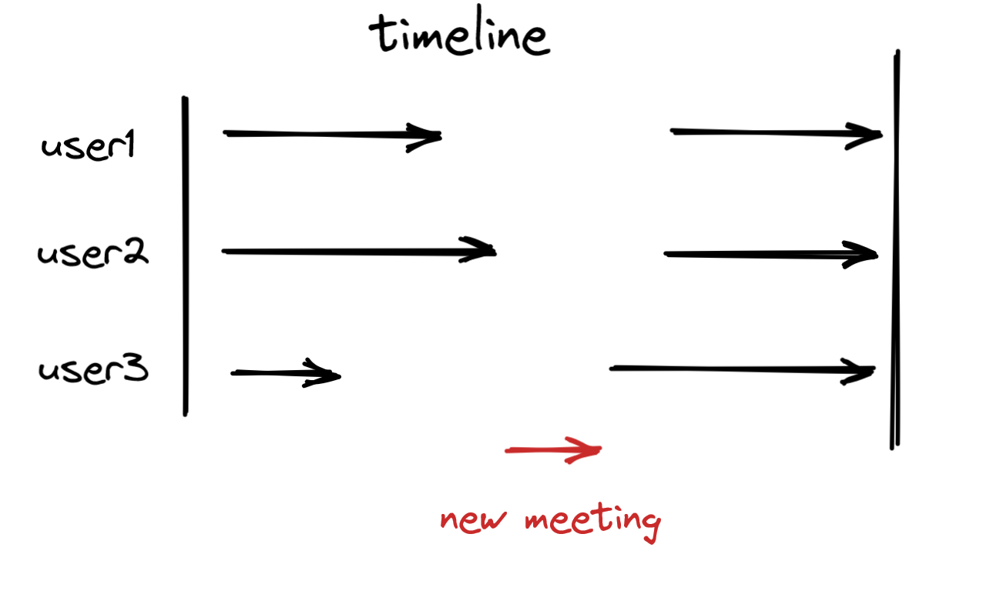

# MeetingApp

[](https://github.com/raxonpc/MeetingApp/blob/main/LICENSE)
[](https://github.com/raxonpc/MeetingApp/issues)


MeetingApp is an open-source and cross-platform application, which simplifies the process of arranging business meetings.

(NOTE - the project lacks an interactive example. It is meant to be used solely as a
library)

## Table of Contents

- [MeetingApp](#meetingapp)
  - [Table of Contents](#table-of-contents)
  - [How it works](#how-it-works)
  - [Usage](#usage)
  - [Dependencies](#dependencies)
  - [Brief history](#brief-history)

## How it works

The app allows one to arrange meetings with other users. It suggests the date which best fits users' schedules.



## Usage

Before building MeetingApp, make sure you have all the build dependencies:

- A C++ compiler (preferably C++20 compliant)
- CMake

You also need the sqlite3 library.

Ubuntu example: 
```sh
sudo apt install build-essential libsqlite3-dev cmake
gh repo clone raxonpc/MeetingApp
cd MeetingApp
mkdir build
cd build
cmake ..
cmake --build .
```

## Dependencies

 - sqlite3
 - ftxui
 - catch2

## Brief history

MeetingApp was made for the March 2023 project contest on the ZaprogramujŻycie discord server.

It was a collab of me and [Wojtek](https://github.com/Wojtus12), 
for whom it was the first contact with Git and the C++ toolchain.
I hope working with me helped him dig into the world of C++ programming.


